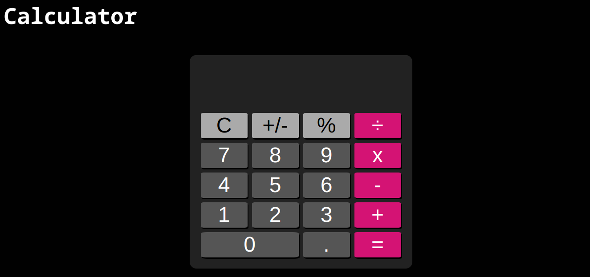
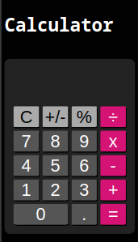

# Calculator
I created this project, a simple calculator, using HTML, CSS, and JavaScript. The calculator features a user-friendly interface with buttons for digits and operators, as well as a display screen. Through this project, I refreshed my knowledge of event handling, DOM manipulation, and the basics of web development.

And this is the result 

- This is what it looks like on a PC with a resolution of 1920x1080:

 

- This is what it looks like on an iPhone SE with a resoution of 375x667:

  
